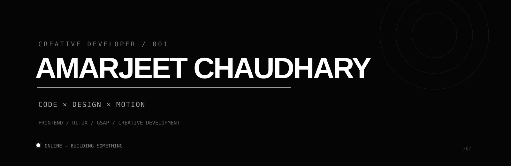

<div align="center">



<br><br>

### `I MAKE WEBSITES MOVE. SOMETIMES THEY BEHAVE.`

`Frontend` · `UI/UX` · `GSAP` · `Creative Development`

<br>

<div align="center">

<a href="https://github.com/thesiyhbrand">
  
</a>
&nbsp;&nbsp;&nbsp;&nbsp;
<a href="mailto:thesiyhbrand@gmail.com">
  
</a>

</div>

</div>

<br>

---

<div align="center">

### `SELECTED WORK`

</div>

<table>
<tr>
<td width="50%">

### `01 / DENNIS-SNELLENBERG`

GSAP animations, smooth interactions and the kind of frontend work that makes you forget you're supposed to be learning.

**30 ★ · 8 forks**

→ [view project](https://github.com/thesiyhbrand/Dennis-Snellenberg)

</td>

<td width="50%">

### `02 / FANTA`

A frontend experiment from the “let's see if I can actually make this” department.

**32 ★ · 15 forks**

→ [view project](https://github.com/thesiyhbrand/fanta)

</td>
</tr>

<tr>
<td width="50%">

### `03 / BOOKS OF DESIGN`

Design, typography and frontend experimentation.

Because apparently one more redesign was necessary.

**11 ★ · 6 forks**

→ [view project](https://github.com/thesiyhbrand/booksofdesign)

</td>

<td width="50%">

### `04 / GENTLERAIN AI`

An AI-themed visual experiment.

The AI is probably more confident than I am.

**6 ★ · 1 fork**

→ [view project](https://github.com/thesiyhbrand/gentlerain-ai-gc)

</td>
</tr>
</table>

---

<div align="center">

### `CURRENTLY`

</div>

```text
learning      → React / Three.js / WebGL
building      → things that probably need GSAP
breaking      → things that worked yesterday
fixing        → things I shouldn't have touched
```

<br>

<div align="center">

> **My development workflow**

`IDEA → CODE → "WHY IS IT DOING THAT?" → GOOGLE → FIX → COFFEE → REPEAT`

</div>

---

<div align="center">

### `THE NUMBERS`

**82+ repositories** · **266 followers** · **∞ unfinished ideas**

<br>

`266 people follow me.`

`At this point I should probably know what I'm doing.`

</div>

---

<div align="center">

### `THE STACK`

`HTML` · `CSS` · `JavaScript` · `React` · `GSAP`
`Three.js` · `WebGL` · `Figma` · `Git`

</div>

<br>

<div align="center">


</div>

---

<div align="center">

### `ONE LAST THING`

<br>

**Good design gets attention.**

**Good interaction keeps it.**

**Good code makes sure nothing catches fire.**

<br>

`— The Siyh Brand`

<br>

<a href="https://github.com/thesiyhbrand">

</a>

</div>
